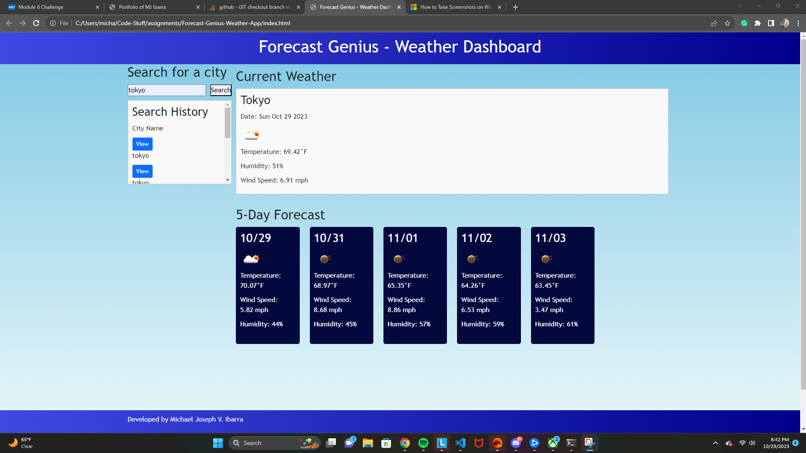

# Forecast Genius - Weather Dashboard
Forecast Genius is a weather dashboard that allows users to get current weather information and a 5-day forecast for a specific city. Users can search for a city, view their search history, and get detailed weather data at a glance.

## Table of Contents
- [Description](#description)
- [Screenshot](#screenshot)
- [License](#license)

## Description
Display the current and future weather of the city a user wishes to see. The web application contains a search container and access to a users search history via localStorage on the left side. On the right side it contains the current weather of the desired city on top, and the conditions for the next five days.

## Screenshot
Screenshot of deployed application:

## License
This project is under the MIT license.

